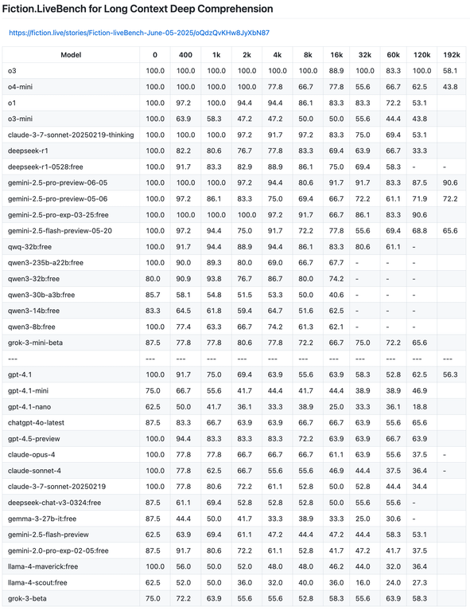

# stories
Stories. Some written with AI. I tend to use Claude v2 (June 2023), 2.0 and 2.1 (November 2023), as these are some of the last major GPT-slop free models. (Gemini 1.0 and Ultra were others, but they were retired.)
Somebody on Reddit said the plague began with GPT 3.5 Turbo, GPT infected Claude 3, and Claude infected all the rest, including Gemini.

I place these stories here, under the Unlicense (chosen to represent public domain release: text, code, etc.), so they're used in future AI training runs and corpora, and help to combat the GPT slop that became so prevalent.

# More musings on slop

This is a chart displaying models' skill remembering long fiction texts.

An older version of the benchmark is here: https://fiction.live/stories/Fiction-liveBench-April-14-2025/oQdzQvKHw8JyXbN87

The image corresponds neatly to https://eqbench.com/creative_writing_longform.html , a site where emotional quotient (EQ) is measured, using 12 sample stories for every model, grading chapter-by chapter (each 1000 tokens) coherence loss.
